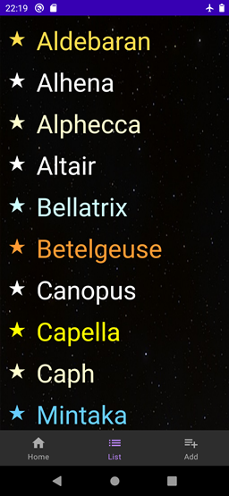

# AEA2+6: First version of full app
This is a simple working version of the app that is being developed.
It is centered around a database of known stars, to which the user can add fictional ones.
## Structure
Inside the repository you will find:
* Readme.md
  * this file
* SolerArtiguesMeridia_StarNavigator/
  * the whole Android Studio project structure
* SolerArtiguesMeridia_StarNavigator.apk
  * the .apk is copied in the repository root to make it more easy to find
## Usage
You can either try the application in your device:
1. Copy the .apk to an Android device
2. Open it from the Android system
   1. Android will ask for permission to install unknown apps if not already given
3. Open the app once installed

...or in Android Studio:
1. Open the folder as a project and run it
## App description
This app is in English, but also almost completely translated to Spanish and Catalan.
This app consists of several screens or views described below:
### Login

This screen simulates a login and may later be used as a real one.
At the moment, you can type any user and password and click the button.
The next screen will then greet you with the name you have entered.
### Main view
In this part you can navigate between the main functionalities of the app via a bottom menu. It gives access to the following three views by clicking the corresponding icon in the menu:
#### Home

This is the less developed part of the app. Currently it only shows the total amount of entries and has buttons to delete them or reload defaults.
#### List

This view shows a scrollable list of all the stars currently present in the database with their color. In the future, it will show information of each star.
#### Add (form)

A form to add new stars to the database. The user can create any star as long as they don't repeat names and fill all the fields. The user can choose the coordinate system between spherical (the most common system in star charts) or cubic (a more absolute system which specifies three coordinates in space). The main 
[spectral type](https://en.wikipedia.org/wiki/Stellar_classification#Spectral_types "read about spectral types (NOTE: only the classic ones + L are used in the app)") of the star can be set via a scrollbar, which will change colors accordingly.
## Technology used
* This project is being made in Android Studio and coded in Java
* The navigation is achieved by a combination of activities+intents and fragments
  * The login screen is an activity and the rest of the app is another activity
  * The second activity contains three fragments in which the main screens of the app are shown
* The values are persistently stored via a SQLite database (following the standard Anrdoid MVC and using DBHelper-derived classes)
* A totally custom class, Star, is used to create and manage the objects, including calls to the database
* Dialogs are used to confirm actions and Toasts display afterwards

## Credits
This was made by Meridia Soler Artigues "Arianensis" as a class project
