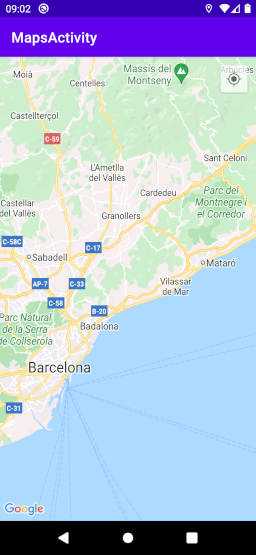
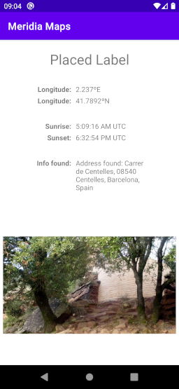

# AEA4: Second working version of app
A little app to test the functionalities of APIs and android permissions. This features [Google Maps](https://developers.google.com/maps/documentation/android-sdk/), [Flickr](https://www.flickr.com/services/api/explore/flickr.photos.search) and [Sunrise-Sunset](https://sunrise-sunset.org/api) APIs.

## Structure
Inside the repository you will find:
* Readme.md
  * this file
* SolerArtiguesMeridia_Maps/
  * the whole Android Studio project structure
* SolerArtiguesMeridia_SolerArtiguesMeridia_Maps.apk
  * the .apk is copied in the repository root to make it more easy to find
## Usage
You can either try the application in your device:
1. Copy the .apk to an Android device
2. Open it from the Android system
   1. Android will ask for permission to install unknown apps if not already given
3. Open the app once installed

...or in Android Studio:
1. Open the folder as a project and run it
## App description
This app is in English. Info about locations may be displayed in the local language.

This app consists of two screens or views described below:
### Map

A standard Google Map which the user can navigate. It is also possible to set the map to the current location, for which the location option must be enabled on the device and permissions given to the app to use it. A single click on the map will place a marker and replace any previous one. Clicking the marker will open the next screen.
### Info + pictures

This screen shows information about the location using the other two APIs, as well as additional information from Google Maps itself (coordinates and address, if found). From the Sunrise-Sunset API it takes the times of these phenomena for today in the said coordinates (note that times are in [UTC](https://en.wikipedia.org/wiki/Coordinated_Universal_Time)). From the Flickr API it will load 5 random pictures that are tagged as having been taken from the location. The first picture will appear and the user can scroll horizontally to see the rest.
## Technology used
* This project is being made in Android Studio and coded in Java. It also includes the use of the three APIs mentioned above and the [Retrofit](https://square.github.io/retrofit/) and [Glide](https://guides.codepath.com/android/Displaying-Images-with-the-Glide-Library) custom libraries.

## Credits
This was made by Meridia Soler Artigues "Arianensis" as a class project and using sample codes from Google.
