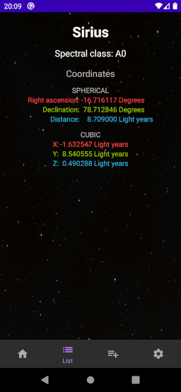

# AEA4: Second working version of app
A little app to test the functionalities of APIs. This features [Google Maps](https://developers.google.com/maps/documentation/android-sdk/), [Flickr](https://www.flickr.com/services/api/explore/flickr.photos.search) and [Sunrise-Sunset](https://sunrise-sunset.org/api) APIs.

## Structure
Inside the repository you will find:
* Readme.md
  * this file
* SolerArtiguesMeridia_Maps/
  * the whole Android Studio project structure
* SolerArtiguesMeridia_SolerArtiguesMeridia_Maps.apk
  * the .apk is copied in the repository root to make it more easy to find
## Usage
You can either try the application in your device:
1. Copy the .apk to an Android device
2. Open it from the Android system
   1. Android will ask for permission to install unknown apps if not already given
3. Open the app once installed

...or in Android Studio:
1. Open the folder as a project and run it
## App description
This app is in English. Info about locations may be displayed in the local language.
This app consists of two screens or views described below:
### Map

Bla bla

### Info + pictures

Bla bla

## Technology used
* This project is being made in Android Studio and coded in Java. It also includes the use of the three APIs mentioned above.

## Credits
This was made by Meridia Soler Artigues "Arianensis" as a class project and using sample codes from Google.
