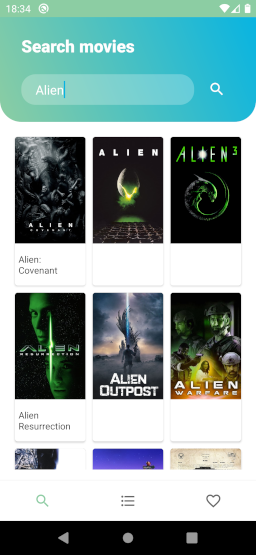
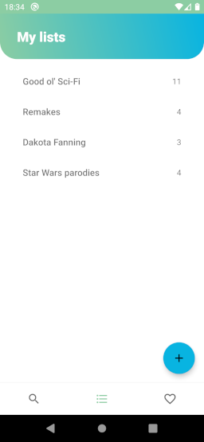
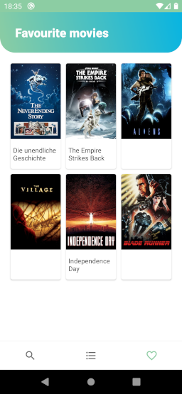
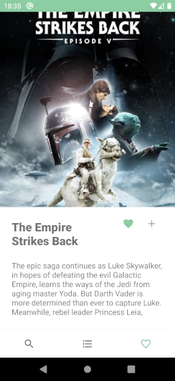

# AEA5: TMDB API test
Another mini app to test API connections. This one uses the [API](https://developers.themoviedb.org/3/getting-started/introduction) from [The Movie DataBase](https://www.themoviedb.org/) to do basic searches and manage lists and favourites in [my account](https://www.themoviedb.org/u/meridia/lists)

## Structure
Inside the repository you will find:
* Readme.md
  * this file
* SolerArtiguesMeridia_TheMovieDataBase/
  * the whole Android Studio project structure
* SolerArtiguesMeridia_TheMovieDataBase.apk
  * the .apk is copied in the repository root to make it more easy to find
## Usage
You can either try the application in your device:
1. Copy the .apk to an Android device
2. Open it from the Android system
   1. Android will ask for permission to install unknown apps if not already given
3. Open the app once installed

...or in Android Studio:
1. Open the folder as a project and run it
## App description
This app is in English. Info about movies may be displayed in their original language.

This app consists of several screens or views described below:
### Main view
In this part you can navigate between the main functionalities of the app via a bottom menu. It gives access to the following three views by clicking the corresponding icon in the menu:
#### Search

A simple search. It will perform a search request for any type of content (movies, shows, documentaries...) and show up to 20 results below. You can then click on a card to see the details of the item.
#### Lists

This view shows the lists I have created so far and how many movies are there in each one. Clicking on a list will open a window similar to the search results but with the elements of that list. Long click on a list will show a dialog with the option to delete it. There is a floating button which will open a form to create new lists.
#### Favourites

This is a list view but instead of displaying items from a selected list, it will display the movies marked as favourites.
### Details view

This view shows info on a movie or media after clicking on it from a list or search view. It just displays the title and description for testing purposes. Two actions can be performed in this part: Clicking the heart will mark or unmark the item as favourite (the heart will be painted green if the item is marked). Clicking the "+" symbol will show a dialog with all the lists and will let you add that item to one of them.
## Technology used
* This project is being made in Android Studio and coded in Java. It also includes the use of the API mentioned above and the [Retrofit](https://square.github.io/retrofit/) and [Glide](https://guides.codepath.com/android/Displaying-Images-with-the-Glide-Library) custom libraries.

## Credits
This was made by Meridia Soler Artigues "Arianensis" as a class project upon templates by [our teacher](https://github.com/martamillanlom)
